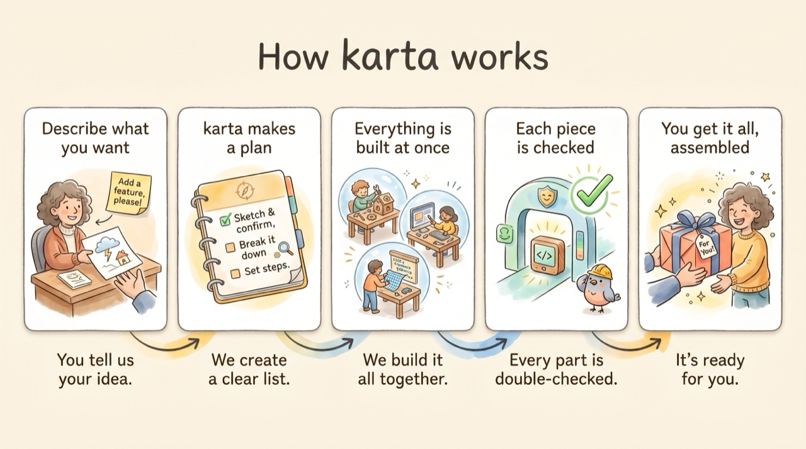
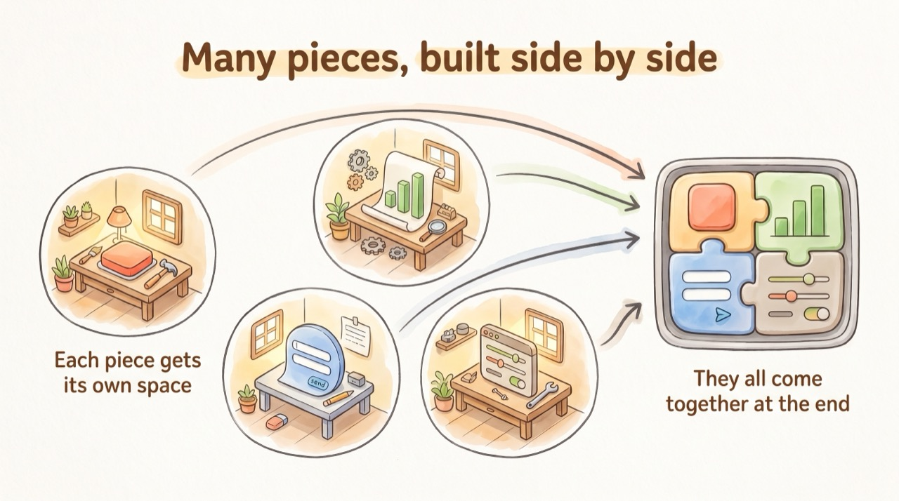
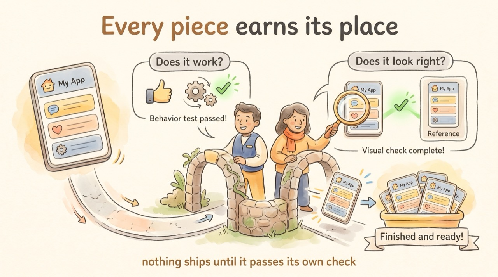
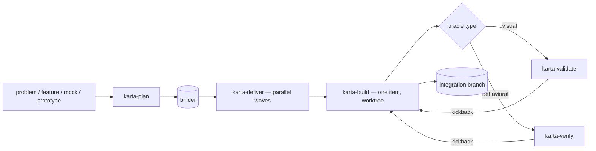

# karta

<p align="center">
  
</p>

> **karta** — a play on *carta* (map/chart): you hand it the territory, it charts the route and delivers you there.

## What it is

karta turns a problem into a plan — a **binder** of work items — then builds every item in parallel and merges them onto one branch. Each item builds in its own git worktree and must pass its own acceptance check before it lands.

It works on any stack — frontend, backend, CLI, data, IaC — and needs no setup: no config, no registry, no stored state. karta reads two things at runtime: the binder and your repo.

It has deep frontend support — component, icon, and design-token mapping, DTCG conformance, and a screenshot-based design check. Those steps fire on UI work and stay quiet on everything else.

## How it works

Ten skills ship in the plugin, but the flow is simple: you describe the job, karta plans it, builds every piece at once (each in its own space), checks each piece against its own test, and merges the lot onto one branch.



| | |
|-|-|
|  |  |
| **Many pieces, built side by side** — each item gets its own git worktree, so parallel work never collides. The finished pieces merge at the end. | **Every piece earns its place** — each item must clear its own gate (does it *work*, does it *look right*) before it lands. |

## Install

karta is a plugin for **both** Claude Code and Codex CLI — both first-class. The GitHub repo is public, so installing needs no auth, but the code is proprietary, not open source; use is governed by the [License](#license). Plugin and skill names are stable since 1.0.

### Claude Code

```bash
/plugin marketplace add https://github.com/Engen-Tech/karta.git
/plugin install karta@karta
```

This registers all karta skills under the `karta:` namespace, plus four agents (two gates, two writers). The gates run automatically as registered read-only subagents; no setup. Full guide: [docs/how-to/claude-code.md](docs/how-to/claude-code.md).

### Codex CLI

Two ways in:

- **Plugin** — add this repo as a marketplace source in `/plugins`, then install karta. Invoke a skill with `$karta-plan` (or `@karta`), or let Codex pick one from your prompt.
- **Clone and run** — run `codex` in a karta checkout. Codex auto-discovers the skills from the committed `.agents/skills/` mirror (real directories, no symlinks, so macOS, Linux, and Windows all work).

The gate runs automatically — no setup. On a plugin install (Codex can't register subagents) `karta-verify` spawns a read-only subagent from the gate instructions bundled in the skill; in a checkout, the same agents run as registered, sandbox-enforced read-only subagents. Full guide: [docs/how-to/codex.md](docs/how-to/codex.md).

## The pipeline

`plan → deliver → build`, gated by `verify` (behavioral) and `validate` (visual). Both gates are read-only.



karta runs items in parallel and goes serial only when two would collide. Need just one item? Run `karta-build` alone. Resume is git-native: the integration branch *is* the record, so a re-run picks up where it stopped.

## The binder

The **binder** is one JSON file (`.karta/binders/<slug>.json`) that drives planning, build, and integration. Every skill reads it; none writes to it during a run, and it can't change while a wave runs.

It holds the slug (which names the integration branch and tags), scope, the env contract, optional design facts and token manifest, optional **shared terms** (strings several items must render identically), and an ordered list of work items. Each item carries its dependencies, an optional `contract`, optional `shared_resources`/`serialize` flags, and an `oracle` — its acceptance check.

`validate_binder.py` checks every binder before a run: schema, dependency cycles, dangling references, opt-outs. Full field guide: [`skills/karta-plan/references/binder-reference.md`](skills/karta-plan/references/binder-reference.md).

## The ten skills

| Skill | What it does |
|-|-|
| **`karta-plan`** | Turns a problem (and optional design mock) into a validated binder. Asks a few questions, drafts the plan, commits when you say so. Same flow for every stack; keeps full frontend depth (component/icon/token mapping) on UI items. |
| **`karta-deliver`** | Builds all the binder's items onto one integration branch in parallel waves, going serial only where needed. Reads the binder, never writes it. No PR, no push — you review and merge. The branch is also the resume record. |
| **`karta-build`** | Builds one item end to end in an isolated worktree: implements, runs your lint/test/build plus the item's `oracle`, clears the gate, and merges. Keeps the full frontend path on UI items. Also the single-item escape hatch. |
| **`karta-verify`** | The behavioral gate (`unit`/`integration`/`e2e`/`smoke`). Runs read-only against the diff, dispatches the two gate agents, and drives kickbacks to build. Never edits code, tests, or the binder. |
| **`karta-validate`** | The visual gate (`type: visual`). Compares a running view against its design prototype — screenshots and DOM — and reports differences in layout, color, type, spacing, and structure. Read-only; one view per call. |
| **`karta-plainlanguage`** | The bundled writing standard. Everything karta shows you — reports, prompts, summaries — is written to be read once and acted on. |
| **`karta-doc-gardner`** | Opt-in doc repair. After a delivery, rewrites any prose docs that drifted from the code, as one labeled commit. |
| **`karta-kaizen`** | Opt-in stack-pack writer. Improves the packs your project uses from what its builds keep repeating; every edit is a labeled commit you review. |
| **`karta-debt`** | On-demand debt harvest. Collects every `KARTA-DEFER` and `KARTA-SME-OVERRIDE` marker into a one-shot ledger. Writes nothing. |
| **`karta-status`** | Shows where a run stands and the single next action, derived fresh from git. Live browser page by default; one-shot terminal map headless. Read-only. |

## The four agents

Two are read-only gates, dispatched by `karta-verify` (and by `karta-build` for the behavioral floor):

- **`karta-acceptance-reviewer`** — checks the diff against the item's `oracle`/`contract`, assertion by assertion. Verdict: `CONFORMANT | DEVIATION | BLOCKED | SPEC-SUSPECT`.
- **`karta-safety-auditor`** — re-runs the seven review signals on the real diff, flagging anything sensitive, destructive, or outside the item's contract. Verdict: `PASS | VIOLATION`.

Two are opt-in writers — off until you enable them, and each edits one surface only:

- **`karta-doc-gardner`** — rewrites drifted prose docs to match the delivered code. Enabled by `.karta/doc-gardner.json`.
- **`karta-kaizen`** — edits the stack packs under `.karta/sme/`. Enabled by `.karta/kaizen.json`.

## Plain language, built in

karta writes everything it shows you — run reports, prompts, summaries — to one standard: read it once and act. The **`karta-plainlanguage`** skill ships in the plugin, so karta reads the same everywhere, whatever your own setup. The rule and what stays exact (code, refs, the machine envelope) live in [`skills/_shared/user-facing-prose.md`](skills/_shared/user-facing-prose.md); the full skill is [`skills/karta-plainlanguage/SKILL.md`](skills/karta-plainlanguage/SKILL.md).

## Automatic doc-gardner (opt-in)

Docs rot. Turn on **doc-gardner** and karta keeps your prose in sync with your code. Add `.karta/doc-gardner.json` with `{"enabled": true}` (and an optional `"focus"` note); every `karta-deliver` run then ends by rewriting any drifted docs — README, `docs/`, `AGENTS.md`, `ARCHITECTURE` — to match the delivered code, as one `docs: gardner <slug>` commit.

It's all or nothing: on, drift is fixed automatically; off, it never runs. Scope is recomputed each run, so a file added later is never missed. The fix lands as a labeled, revertible commit on the branch you already review. It ships the **`karta-doc-gardner`** skill and a writer agent that edits docs and nothing else. Full guide: [`docs/how-to/doc-gardner.md`](docs/how-to/doc-gardner.md).

## Kaizen: the stack-pack writer (opt-in)

**kaizen** is the second writer, after doc-gardner — the one that edits your stack packs. Add `.karta/kaizen.json` with `{"enabled": true}` (and an optional `"focus"` note); every `karta-deliver` run then ends with a kaizen pass. The first enabled run copies every pack your project uses into `.karta/sme/` — from then on those files are the packs. Off means it never runs, even invoked directly.

Every change lands as a labeled `kaizen:` commit on the branch you already review — no PR, no push. Kaizen writes knowledge and never changes what gates a build; sharpening rules and suggesting new packs arrive in later phases. It ships the **`karta-kaizen`** skill and a writer agent confined to your packs. Full guide: [`docs/how-to/kaizen.md`](docs/how-to/kaizen.md).

## Stack packs

Curated **stack packs** make karta plan and build the way each stack expects. karta detects your stack from its manifests and applies the packs whose match tokens equal a detected dependency or language — built-ins for `angular`, `vue`, `python`, `python-fastapi`, `go-naming`, and `go-htmx` — plus an always-on `minimalism` pack that keeps every project from over-building. Each pack carries advisory Do/Don't guidance the builder writes against, and an enforced **Review checklist** of diff-checkable rules with stable ids (`min.1`, `ng.3`) the safety-auditor judges every item's diff against. A justified miss is declared in place with a `KARTA-SME-OVERRIDE(<rule-id>): <rationale>` marker, and **`karta-debt`** harvests every marker into a one-shot ledger so overrides never rot silently. Add your own pack — or override a built-in by name — by dropping a file in `.karta/sme/`. Authoring guide: [`docs/how-to/stack-packs.md`](docs/how-to/stack-packs.md).

## Enforcement below the agent

The rules that matter most don't rely on the agent remembering them. On Claude Code, the plugin ships **hooks** — scripts the harness runs deterministically around tool calls: committed binders are read-only, edits under `.karta/sme/` must pass the pack validator, the kaizen writer may write only under `.karta/sme/` and to `.karta/kaizen.json` — any other write is blocked before it lands — a safety-auditor dispatch missing its binder or pinned checklists is blocked before it starts, and a session cannot silently end with built-but-unmerged items or a complete-but-unarchived binder: it is blocked once with the fix named, then the next identical stop passes (a sixth hook lists your binders at session start). On Codex, the same rules hold as skill doctrine backed by the OS sandbox and execpolicy rules until its hooks surface stabilizes — the scripts are runtime-agnostic so that switch needs no rewrite. Skills still state every rule; hooks are the backstop. Full guide: [`docs/how-to/hooks.md`](docs/how-to/hooks.md).

## Consistent wording across items

karta builds each item in isolation, so two items can word the same user-facing string differently and no per-item gate would notice. A binder heads that off: a **`shared_terms`** entry names a canonical substring and the items that must render it identically. `karta-plan` surfaces candidates while planning; a pure-stdlib, deterministic `check_shared_terms.py` — byte-identity, no fuzzy matching — enforces them on the assembled branch at the end of every wave and in the single-item hatch, halting the delivery if one drifts (an item not yet built is skipped until it lands). It's the deterministic backstop for the one thing isolated gates can't see: wording that must agree across items with no dependency between them. Field guide: [`skills/karta-plan/references/binder-reference.md`](skills/karta-plan/references/binder-reference.md).

## Cross-cutting

- **Any stack.** No skill assumes a framework, library, data layer, or repo layout. Tool names in the docs (Next.js, Style Dictionary, `playwright-cli`, `localhost:3000`) are examples, resolved per project.
- **No setup.** No config, registry, or stored state — just the binder and your repo, read at runtime.
- **Parallel, gated.** Items run in waves and serialize only on collisions; each clears its gate before merging.
- **Git-native resume.** The integration branch is the record; a re-run continues or clears a partial one.
- **No PR.** karta stops at the assembled branch. You review and merge — it never opens a PR or pushes.

## Requirements

- **`karta-plan`** — read access to the work description/design and the repo. Writes only the binder.
- **`karta-deliver` and `karta-build`** — `git` (per-item worktrees), your package manager + toolchain (lint/test/build/dev), and the binder on disk.
- **`karta-verify`** — the diff and the binder. Read-only.
- **`karta-validate`** — [`uv`](https://docs.astral.sh/uv/), [`playwright-cli`](https://playwright.dev) (`npm install -g @playwright/cli@latest`, then `playwright-cli install --skills`), and Chromium. The app must already be running — you own the dev server.

## License

Proprietary and confidential. Copyright (c) 2026 Tej Gandham. All rights reserved.

The source is published for viewing only — no license, express or implied, is granted to use, copy, modify, distribute, host, or create derivative works of it. See [LICENSE](LICENSE) for the full terms. To request a license, contact the Owner at `inquiries [at] engen [dot] tech`.
