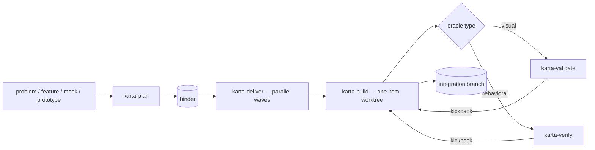

# karta

## What it is

karta is a **stack-agnostic, ad-hoc orchestration framework** — narrow, unopinionated, repo-directed. You hand it a problem; it synthesizes a **binder** of work items, then delivers that binder in **parallel waves** onto a per-binder integration branch, building each item in its own isolated git worktree and gating each one against its own acceptance check. There is no project setup, no registry, no invariants file, no stored state — karta reads the binder and the repo at runtime and nothing else.

It **grew out of, and still contains, a strong frontend pipeline.** UI is one stack among many here — not the default — but the deep frontend machinery is intact: component-to-library mapping, icon mapping, design-token mapping, DTCG conformance, and a screenshot-driven design-validation loop. On a UI item those steps light up; on a backend, CLI, data, or IaC item they simply don't.

## The pipeline

`plan → deliver → build`, with `verify` (behavioral) and `validate` (visual) as the **read-only acceptance gates**, and two read-only agents as the gate workers.



Default is parallel; karta drops to serial only where correctness or collision demands it. The single-item escape hatch is `karta-build` on its own. Resume is git-native — the integration branch *is* the record, so a later run picks up where a partial one stopped.

## The binder

The **binder** is karta's spine: one JSON artifact (`.karta/binders/<slug>.json`) that drives planning, build, and integration end to end. Every skill reads it; none of them write to it during a build run. It is immutable while a wave runs. It carries the slug (which names the integration branch and wave tags), scope, the env contract, optional design facts and token manifest, and an ordered list of work items — each with its dependencies, optional `contract`, optional `shared_resources`/`serialize` flags, and an `oracle` (its acceptance check). The shape is karta's own. `validate_binder.py` gates every binder before a run (schema, dependency cycles, dangling references, opt-out summary).

The binder is the cross-skill contract — it **replaces the old ticket contract**. Full field guide: [`skills/karta-plan/references/binder-reference.md`](skills/karta-plan/references/binder-reference.md).

## The five skills

### karta-plan

Ingests a problem or feature description (optionally a design mock or non-functional prototype) and — without fail — **synthesizes a validated binder of work items**. It asks a minimal set of questions, runs a synthesis subagent to draft the binder, and commits on an explicit "commit" verb. It is stack-agnostic: it plans frontend, backend, CLI, data, library/SDK, IaC, mobile, ML, and docs work the same way. On a UI surface it keeps the **full frontend depth** — component/icon/token mapping and DTCG-aware token planning — emitted as the conditional UI fields on the relevant work items.

### karta-deliver

Takes a **validated binder** and builds all its work items onto the per-binder integration branch in **parallel waves**, serializing only where running two items together would produce a wrong or broken result. It reads the binder, never writes it. The output is a single assembled integration branch you review and merge — no PR, no push. The integration branch is also the resume record: karta tracks every item through commit markers, wave tags, and the `refs/karta/` namespace, so a later run detects leftovers and offers to continue or clear.

### karta-build

Carries **one work item** from pickup to a tagged set of commits merged into the binder's integration branch, all inside an isolated git worktree. Stack-agnostic — the same flow implements a frontend view, a backend endpoint, a CLI command, a data migration, or an IaC change — it resolves a small set of project settings up front (detect → ask), then implements against whatever it finds. It runs the project's lint/test/build plus the item's `oracle`, dispatches the gate, and merges. On a UI item it keeps the **full frontend path**: component/icon/token implementation, DTCG token conformance (Phase 5), data-layer conformance, and the design-validation loop. It does **not** open a PR; it is also the single-item escape hatch.

### karta-verify

The thin orchestrator for the **behavioral acceptance gate** — for oracle types `unit` / `integration` / `e2e` / `smoke`. It runs read-only in a fresh session against the actual diff, dispatches the two gate agents, aggregates their verdicts, and drives the kickback-to-build and human-escalation loop. It never edits code, tests, or the binder. Visual oracles are not its concern (those go to `karta-validate`); opt-out oracles bypass it entirely.

### karta-validate

karta's **visual acceptance gate** — the gate for oracle `type: visual` items. It compares a single running frontend view against its design prototype (Claude Design or runtime-JSX export), opening both the live app and the served design through bundled `uv`-run capture scripts, capturing screenshots and DOM snapshots, then reporting structured discrepancies across layout, color, typography, spacing, component structure, and visual hierarchy. It is read-only: it reports kickback input for `karta-build` to self-correct and never fixes anything itself. One view per invocation — the calling pipeline loops.

## The two agents

Both are **read-only verification gates** dispatched by `karta-verify` (and, for the behavioral floor, by `karta-build`):

- **`karta-acceptance-reviewer`** — judges the diff against the work item's `oracle`/`contract` assertion by assertion: verdict `CONFORMANT | DEVIATION | BLOCKED | SPEC-SUSPECT`.
- **`karta-safety-auditor`** — re-runs the seven smart-surfaced-review signals against the real diff and flags any sensitive, destructive, or contract crossing the item never justified: verdict `PASS | VIOLATION`.

## Plain language, built in

karta carries its own writing standard and applies it to everything it shows you — run reports, halt calls-to-action, the accept/defer prompt, plan and opt-out summaries. The aim is plain: read it once and act, no rereading.

It ships the **`karta-plainlanguage`** skill in the plugin, so karta reads the same way wherever it runs — no dependence on your own setup. The rule and its scope (what counts as user-facing prose, and what stays exact — code, refs, the machine envelope) live in [`skills/_shared/user-facing-prose.md`](skills/_shared/user-facing-prose.md); each skill and gate agent points to it where it talks to you. The full skill is [`skills/karta-plainlanguage/SKILL.md`](skills/karta-plainlanguage/SKILL.md).

## Cross-cutting

- **Stack-agnostic.** No skill assumes a component library, framework, data layer, branch convention, or repo layout. UI is one stack among many, not the only one — concrete tools in the docs (Next.js, Style Dictionary, `playwright-cli`, `localhost:3000`, …) are **examples**, resolved per project.
- **Ad-hoc, repo-directed.** No setup, no project guide, no invariants registry, no stored state. karta reads the binder and the repo at runtime; that's all it consults.
- **Parallel by default, gated.** Items run concurrently in waves and serialize only where correctness or collision demands it; every non-opted-out item clears its acceptance gate before it merges.
- **Git-native resume.** The integration branch is the record — commit markers, wave tags, and `refs/karta/` refs let a later run continue or clear a partial one.
- **No PR.** Delivery ends at the assembled integration branch. You review and merge it; karta never opens a PR or pushes.

## Layout

```
karta/
  .claude-plugin/     plugin.json + marketplace.json   (Claude Code packaging)
  .codex-plugin/      plugin.json                      (Codex packaging)
  .agents/plugins/    marketplace.json                 (repo-local Codex marketplace)
  README.md
  agents/             karta-acceptance-reviewer.md  +  karta-safety-auditor.md
  skills/
    karta-plan/      SKILL.md  +  references/{binder-reference.md, …}
    karta-deliver/   SKILL.md  +  references/{integration-branch.md, parallelism-gates.md, …}
    karta-build/     SKILL.md  +  references/…
    karta-verify/    SKILL.md  +  references/verification-gate.md
    karta-validate/  SKILL.md  +  scripts/{serve_design.py, capture_view.py}
    karta-plainlanguage/  SKILL.md                 (bundled writing standard)
```

Skills and agents are both auto-discovered: each skill is a directory whose `SKILL.md` carries the frontmatter and workflow (with heavy material in `references/` loaded on demand), and each agent is a markdown file under `agents/` with `name`/`description` frontmatter. The plugin manifests do not enumerate either.

## Requirements

- **`karta-plan`** needs read access to the work description / design source and the repo; it writes only the binder, never implementation code.
- **`karta-deliver`** and **`karta-build`** need `git` (per-item worktrees), the project's package manager + toolchain (lint/test/build/dev), and the binder on disk.
- **`karta-verify`** needs the diff and the binder; it dispatches the two gate agents and runs read-only.
- **`karta-validate`** needs [`uv`](https://docs.astral.sh/uv/), [`playwright-cli`](https://playwright.dev) (`npm install -g @playwright/cli@latest`, then `playwright-cli install --skills`), and a browser (Chromium). The running app must already be up — the caller owns the dev server's lifecycle.

## Install

karta ships as a self-contained Claude Code plugin + marketplace (the `.claude-plugin/` manifests). Add the marketplace and install from the **public GitHub** repo, which needs no auth:

```bash
/plugin marketplace add https://github.com/TejGandham/karta.git
/plugin install karta@karta
```

This registers all six skills, namespaced under the plugin — the five pipeline skills (`karta:karta-plan`, `karta:karta-deliver`, `karta:karta-build`, `karta:karta-verify`, `karta:karta-validate`) plus `karta:karta-plainlanguage` — and the two gate agents. (Pre-1.0: the names keep the `karta-` prefix; they may shorten at a stable release.)
