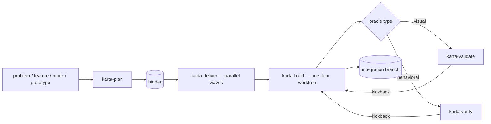

# karta

## What it is

karta is a **stack-agnostic, ad-hoc orchestration framework** — narrow, unopinionated, repo-directed. You hand it a problem; it synthesizes a **binder** of work items, then delivers that binder in **parallel waves** onto a per-binder integration branch, building each item in its own isolated git worktree and gating each one against its own acceptance check. There is no project setup, no registry, no invariants file, no stored state — karta reads the binder and the repo at runtime and nothing else.

It **grew out of, and still contains, a strong frontend pipeline.** UI is one stack among many here — not the default — but the deep frontend machinery is intact: component-to-library mapping, icon mapping, design-token mapping, DTCG conformance, and a screenshot-driven design-validation loop. On a UI item those steps light up; on a backend, CLI, data, or IaC item they simply don't.

## The pipeline

`plan → deliver → build`, with `verify` (behavioral) and `validate` (visual) as the **read-only acceptance gates**, and two read-only agents as the gate workers.



Default is parallel; karta drops to serial only where correctness or collision demands it. The single-item escape hatch is `karta-build` on its own. Resume is git-native — the integration branch *is* the record, so a later run picks up where a partial one stopped.

## The binder

The **binder** is karta's spine: one JSON artifact (`.karta/binders/<slug>.json`) that drives planning, build, and integration end to end. Every skill reads it; none of them write to it during a build run. It is immutable while a wave runs. It carries the slug (which names the integration branch and wave tags), scope, the env contract, optional design facts and token manifest, and an ordered list of work items — each with its dependencies, optional `contract`, optional `shared_resources`/`serialize` flags, and an `oracle` (its acceptance check). The shape is karta's own. `validate_binder.py` gates every binder before a run (schema, dependency cycles, dangling references, opt-out summary).

The binder is the cross-skill contract — it **replaces the old ticket contract**. Full field guide: [`skills/karta-plan/references/binder-reference.md`](skills/karta-plan/references/binder-reference.md).

## The five skills

### karta-plan

Ingests a problem or feature description (optionally a design mock or non-functional prototype) and — without fail — **synthesizes a validated binder of work items**. It asks a minimal set of questions, runs a synthesis subagent to draft the binder, and commits on an explicit "commit" verb. It is stack-agnostic: it plans frontend, backend, CLI, data, library/SDK, IaC, mobile, ML, and docs work the same way. On a UI surface it keeps the **full frontend depth** — component/icon/token mapping and DTCG-aware token planning — emitted as the conditional UI fields on the relevant work items.

### karta-deliver

Takes a **validated binder** and builds all its work items onto the per-binder integration branch in **parallel waves**, serializing only where running two items together would produce a wrong or broken result. It reads the binder, never writes it. The output is a single assembled integration branch you review and merge — no PR, no push. The integration branch is also the resume record: karta tracks every item through commit markers, wave tags, and the `refs/karta/` namespace, so a later run detects leftovers and offers to continue or clear.

### karta-build

Carries **one work item** from pickup to a tagged set of commits merged into the binder's integration branch, all inside an isolated git worktree. Stack-agnostic — the same flow implements a frontend view, a backend endpoint, a CLI command, a data migration, or an IaC change — it resolves a small set of project settings up front (detect → ask), then implements against whatever it finds. It runs the project's lint/test/build plus the item's `oracle`, dispatches the gate, and merges. On a UI item it keeps the **full frontend path**: component/icon/token implementation, DTCG token conformance (Phase 5), data-layer conformance, and the design-validation loop. It does **not** open a PR; it is also the single-item escape hatch.

### karta-verify

The thin orchestrator for the **behavioral acceptance gate** — for oracle types `unit` / `integration` / `e2e` / `smoke`. It runs read-only in a fresh session against the actual diff, dispatches the two gate agents, aggregates their verdicts, and drives the kickback-to-build and human-escalation loop. It never edits code, tests, or the binder. Visual oracles are not its concern (those go to `karta-validate`); opt-out oracles bypass it entirely.

### karta-validate

karta's **visual acceptance gate** — the gate for oracle `type: visual` items. It compares a single running frontend view against its design prototype (Claude Design or runtime-JSX export), opening both the live app and the served design through bundled `uv`-run capture scripts, capturing screenshots and DOM snapshots, then reporting structured discrepancies across layout, color, typography, spacing, component structure, and visual hierarchy. It is read-only: it reports kickback input for `karta-build` to self-correct and never fixes anything itself. One view per invocation — the calling pipeline loops.

## The two agents

Both are **read-only verification gates** dispatched by `karta-verify` (and, for the behavioral floor, by `karta-build`):

- **`karta-acceptance-reviewer`** — judges the diff against the work item's `oracle`/`contract` assertion by assertion: verdict `CONFORMANT | DEVIATION | BLOCKED | SPEC-SUSPECT`.
- **`karta-safety-auditor`** — re-runs the seven smart-surfaced-review signals against the real diff and flags any sensitive, destructive, or contract crossing the item never justified: verdict `PASS | VIOLATION`.

## Plain language, built in

karta carries its own writing standard and applies it to everything it shows you — run reports, halt calls-to-action, the accept/defer prompt, plan and opt-out summaries. The aim is plain: read it once and act, no rereading.

It ships the **`karta-plainlanguage`** skill in the plugin, so karta reads the same way wherever it runs — no dependence on your own setup. The rule and its scope (what counts as user-facing prose, and what stays exact — code, refs, the machine envelope) live in [`skills/_shared/user-facing-prose.md`](skills/_shared/user-facing-prose.md); each skill and gate agent points to it where it talks to you. The full skill is [`skills/karta-plainlanguage/SKILL.md`](skills/karta-plainlanguage/SKILL.md).

## Automatic doc-gardner (opt-in)

Docs rot. Turn on the **doc-gardner** and karta keeps a repo's prose in lockstep with its code automatically. Drop a `.karta/doc-gardner.json` with `{"enabled": true}` (optionally a freeform `"focus"` note) and every `karta-deliver` run ends with a doc-gardner phase: it rewrites any drifted docs (README, `docs/`, `AGENTS.md`, `ARCHITECTURE`) to match the just-delivered code and commits them as one `docs: gardner <slug>` commit on the integration branch.

It is **all or nothing** — opted in, drift is corrected automatically; opted out, it never runs. No advisory tier, no human waive, no halt. Scope is recomputed live every run (the doc surface is re-globbed, the blast radius re-derived from git), so a file added later is never frozen out. The corrections land as a labeled, revertible commit on the branch you already review before merging — that is the review surface.

It ships the **`karta-doc-gardner`** skill and its writer agent — the one karta agent that edits, and only docs. Full guide: [`docs/how-to/doc-gardner.md`](docs/how-to/doc-gardner.md).

## Domain experts (SME packs)

karta carries curated **SME packs** so planning and implementation follow good norms. There are two kinds:

- **Stack packs** switch on when your project uses that tech — built-ins ship for `angular` and `python-fastapi`.
- **Rule packs** apply to every project — the built-in `minimalism` pack distils ponytail's ladder (write the least code that works; reach for the stdlib and the platform before a dependency) at its "full" level.

At plan time karta applies the rule packs plus any stack packs that match the repo, and pins their ids in the binder's `sme` field; karta-build loads them to write against. ponytail's "use the platform" tables ship as a shared `platform-native` reference the packs link to. A project adds or overrides any pack — stack or rule — by dropping `.karta/sme/<id>.md` in its repo (project-local wins on a name clash); a no-op file silences a built-in rule pack.

Each pack's **Review checklist** is the enforceable part (checklist items are diff-checkable; the advisory do's/don'ts and the ladder never block). Before commit the build implementer self-checks its diff; a deliberate deviation is declared inline with a `KARTA-SME-OVERRIDE(<pack>: <rule>): <reason>` marker, optionally naming where the shortcut breaks and what forces a revisit. The existing `karta-safety-auditor` then flags any **undeclared** checklist violation as a boundary crossing the item never justified — a kickback, escalating to you at its cap. A declared override passes and is surfaced in the run report. The acceptance gate stays SME-unaware: exactly one acceptance authority.

Two companions: **`/karta-debt`** harvests every deferral and override marker across the repo into a one-shot, read-only ledger (it flags any shortcut with no upgrade trigger, and writes nothing — karta keeps no backlog), and **`benchmarks/sme/`** is an A/B method to check a pack actually helps (same task with and without the pack: less code, gate still green), reporting only benchmark deltas, never an invented per-repo savings figure.

## Cross-cutting

- **Stack-agnostic.** No skill assumes a component library, framework, data layer, branch convention, or repo layout. UI is one stack among many, not the only one — concrete tools in the docs (Next.js, Style Dictionary, `playwright-cli`, `localhost:3000`, …) are **examples**, resolved per project.
- **Ad-hoc, repo-directed.** No setup, no project guide, no invariants registry, no stored state. karta reads the binder and the repo at runtime; that's all it consults.
- **Parallel by default, gated.** Items run concurrently in waves and serialize only where correctness or collision demands it; every non-opted-out item clears its acceptance gate before it merges.
- **Git-native resume.** The integration branch is the record — commit markers, wave tags, and `refs/karta/` refs let a later run continue or clear a partial one.
- **No PR.** Delivery ends at the assembled integration branch. You review and merge it; karta never opens a PR or pushes.

## Layout

```
karta/
  .claude-plugin/     plugin.json + marketplace.json   (Claude Code packaging)
  .codex-plugin/      plugin.json                      (Codex packaging)
  .codex/agents/      *.toml                           (Codex gate subagents — generated)
  .agents/plugins/    marketplace.json                 (repo-local Codex marketplace)
  .agents/skills/     <skill>/…                        (repo-local Codex skill mirror — generated)
  plugins/karta/      Codex marketplace install projection — generated real files
  AGENTS.md           contributor orientation (both runtimes)
  README.md
  agents/             karta-acceptance-reviewer.md  +  karta-safety-auditor.md  +  karta-doc-gardner.md   (canonical)
  skills/
    karta-plan/      SKILL.md  +  agents/openai.yaml  +  references/{binder-reference.md, …}
    karta-deliver/   SKILL.md  +  agents/openai.yaml  +  references/{integration-branch.md, …}
    karta-build/     SKILL.md  +  agents/openai.yaml  +  references/…
    karta-verify/    SKILL.md  +  references/{verification-gate.md, *.agent.md}  (bundled gate instructions)
    karta-validate/  SKILL.md  +  scripts/{serve_design.py, capture_view.py}
    karta-plainlanguage/  SKILL.md                 (bundled writing standard)
    karta-doc-gardner/    SKILL.md  +  references/{karta-doc-gardner.agent.md, doc-gardner-schema.json}  (opt-in doc correction)
  scripts/            validate_plugin.py + sync_codex_skills.py + sync_codex_agents.py + …
```

Each skill is a directory whose `SKILL.md` carries the frontmatter and workflow (with heavy material in `references/` loaded on demand); each agent is a markdown file under `agents/` with `name`/`description` frontmatter. Skills are listed explicitly in the Claude marketplace manifest (`.claude-plugin/marketplace.json`, a `strict` plugin entry) and bundled from `skills/` by the Codex manifest. The `skills/` and `agents/` trees are **canonical**; the Codex projections — `.agents/skills/` (repo-local discovery), `plugins/karta/` (marketplace install path), and `.codex/agents/*.toml` plus the bundled `*.agent.md` gate instructions — are **generated** by `sync_codex_skills.py` / `sync_codex_agents.py` and kept byte-identical to their source. The two directory projections are real files, not symlinks, so Codex sees them on Windows, macOS, and Linux. `validate_plugin.py` checks every manifest, mirror file, and projection in one pass, so nothing drifts. See `AGENTS.md` for the edit-then-generate workflow.

## Requirements

- **`karta-plan`** needs read access to the work description / design source and the repo; it writes only the binder, never implementation code.
- **`karta-deliver`** and **`karta-build`** need `git` (per-item worktrees), the project's package manager + toolchain (lint/test/build/dev), and the binder on disk.
- **`karta-verify`** needs the diff and the binder; it dispatches the two gate agents and runs read-only.
- **`karta-validate`** needs [`uv`](https://docs.astral.sh/uv/), [`playwright-cli`](https://playwright.dev) (`npm install -g @playwright/cli@latest`, then `playwright-cli install --skills`), and a browser (Chromium). The running app must already be up — the caller owns the dev server's lifecycle.

## Install

karta ships as a self-contained Claude Code plugin + marketplace (the `.claude-plugin/` manifests). Add the marketplace and install from the **public GitHub** repo, which needs no auth:

```bash
/plugin marketplace add https://github.com/TejGandham/karta.git
/plugin install karta@karta
```

This registers all seven skills, namespaced under the plugin — the five pipeline skills (`karta:karta-plan`, `karta:karta-deliver`, `karta:karta-build`, `karta:karta-verify`, `karta:karta-validate`) plus `karta:karta-plainlanguage` and the opt-in `karta:karta-doc-gardner` — and the three agents (two read-only gates plus the doc-gardner writer). (The plugin and skill names are stable since 1.0 with the `karta-` prefix.)

## Use with Codex CLI

karta ships the same skills to Codex two ways:

- **Plugin** — install from the repo marketplace (`.agents/plugins/marketplace.json`, which points at the generated `plugins/karta` install projection). Open `/plugins` in Codex, add this repo as a marketplace source, and install karta. All seven skills come along; invoke one explicitly with `$karta-plan` (or `@karta`), or let Codex pick it implicitly from your prompt.
- **Clone and run** — run `codex` inside a karta checkout. Codex auto-discovers the skills from the committed `.agents/skills/` mirror (real directories, no symlink, so it works on macOS, Linux, and Windows).

**The gate runs automatically — no setup.** Codex plugins can't register subagents, so on a plugin install `karta-verify` spawns a read-only subagent using the gate instructions bundled inside the skill (`references/*.agent.md`). In a karta checkout, or any project carrying `.codex/agents/*.toml`, the same agents run as registered read-only subagents with sandbox-enforced read-only. Either way you copy nothing. Full details and the one read-only-enforcement nuance are in [docs/how-to/codex.md](docs/how-to/codex.md).
