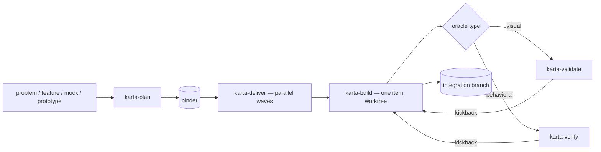

# karta

<p align="center">
  
</p>

> **karta** — a play on *carta* (map/chart): you hand it the territory, it charts the route and delivers you there.

## What it is

karta turns a problem into a plan — a **binder** of work items — then builds every item in parallel and merges them onto one branch. Each item builds in its own git worktree and must pass its own acceptance check before it lands.

It works on any stack — frontend, backend, CLI, data, IaC — and needs no setup: no config, no registry, no stored state. karta reads two things at runtime: the binder and your repo.

It began as a frontend tool and keeps deep frontend support — component, icon, and design-token mapping, DTCG conformance, and a screenshot-based design check. Those steps fire on UI work and stay quiet on everything else.

## How it works

Five skills do the work, but the flow is simple: you describe the job, karta plans it, builds every piece at once (each in its own space), checks each piece against its own test, and merges the lot onto one branch.


| | |
|-|-|
|  |  |
| **Many pieces, built side by side** — each item gets its own git worktree, so parallel work never collides. The finished pieces merge at the end. | **Every piece earns its place** — each item must clear its own gate (does it *work*, does it *look right*) before it lands. |

## The pipeline

`plan → deliver → build`, gated by `verify` (behavioral) and `validate` (visual). Both gates are read-only.



karta runs items in parallel and goes serial only when two would collide. Need just one item? Run `karta-build` alone. Resume is git-native: the integration branch *is* the record, so a re-run picks up where it stopped.

## The binder

The **binder** is one JSON file (`.karta/binders/<slug>.json`) that drives planning, build, and integration. Every skill reads it; none writes to it during a run, and it can't change while a wave runs.

It holds the slug (which names the integration branch and tags), scope, the env contract, optional design facts and token manifest, and an ordered list of work items. Each item carries its dependencies, an optional `contract`, optional `shared_resources`/`serialize` flags, and an `oracle` — its acceptance check.

`validate_binder.py` checks every binder before a run: schema, dependency cycles, dangling references, opt-outs. Full field guide: [`skills/karta-plan/references/binder-reference.md`](skills/karta-plan/references/binder-reference.md).

## The five skills

| Skill | What it does |
|-|-|
| **`karta-plan`** | Turns a problem (and optional design mock) into a validated binder. Asks a few questions, drafts the plan, commits when you say so. Same flow for every stack; keeps full frontend depth (component/icon/token mapping) on UI items. |
| **`karta-deliver`** | Builds all the binder's items onto one integration branch in parallel waves, going serial only where needed. Reads the binder, never writes it. No PR, no push — you review and merge. The branch is also the resume record. |
| **`karta-build`** | Builds one item end to end in an isolated worktree: implements, runs your lint/test/build plus the item's `oracle`, clears the gate, and merges. Keeps the full frontend path on UI items. Also the single-item escape hatch. |
| **`karta-verify`** | The behavioral gate (`unit`/`integration`/`e2e`/`smoke`). Runs read-only against the diff, dispatches the two gate agents, and drives kickbacks to build. Never edits code, tests, or the binder. |
| **`karta-validate`** | The visual gate (`type: visual`). Compares a running view against its design prototype — screenshots and DOM — and reports differences in layout, color, type, spacing, and structure. Read-only; one view per call. |

## The two agents

Both run read-only, dispatched by `karta-verify` (and by `karta-build` for the behavioral floor):

- **`karta-acceptance-reviewer`** — checks the diff against the item's `oracle`/`contract`, assertion by assertion. Verdict: `CONFORMANT | DEVIATION | BLOCKED | SPEC-SUSPECT`.
- **`karta-safety-auditor`** — re-runs the seven review signals on the real diff, flagging anything sensitive, destructive, or outside the item's contract. Verdict: `PASS | VIOLATION`.

## Plain language, built in

karta writes everything it shows you — run reports, prompts, summaries — to one standard: read it once and act. The **`karta-plainlanguage`** skill ships in the plugin, so karta reads the same everywhere, whatever your own setup. The rule and what stays exact (code, refs, the machine envelope) live in [`skills/_shared/user-facing-prose.md`](skills/_shared/user-facing-prose.md); the full skill is [`skills/karta-plainlanguage/SKILL.md`](skills/karta-plainlanguage/SKILL.md).

## Automatic doc-gardner (opt-in)

Docs rot. Turn on **doc-gardner** and karta keeps your prose in sync with your code. Add `.karta/doc-gardner.json` with `{"enabled": true}` (and an optional `"focus"` note); every `karta-deliver` run then ends by rewriting any drifted docs — README, `docs/`, `AGENTS.md`, `ARCHITECTURE` — to match the delivered code, as one `docs: gardner <slug>` commit.

It's all or nothing: on, drift is fixed automatically; off, it never runs. Scope is recomputed each run, so a file added later is never missed. The fix lands as a labeled, revertible commit on the branch you already review. It ships the **`karta-doc-gardner`** skill and a writer agent — the only karta agent that edits, and only docs. Full guide: [`docs/how-to/doc-gardner.md`](docs/how-to/doc-gardner.md).

## Cross-cutting

- **Any stack.** No skill assumes a framework, library, data layer, or repo layout. Tool names in the docs (Next.js, Style Dictionary, `playwright-cli`, `localhost:3000`) are examples, resolved per project.
- **No setup.** No config, registry, or stored state — just the binder and your repo, read at runtime.
- **Parallel, gated.** Items run in waves and serialize only on collisions; each clears its gate before merging.
- **Git-native resume.** The integration branch is the record; a re-run continues or clears a partial one.
- **No PR.** karta stops at the assembled branch. You review and merge — it never opens a PR or pushes.

## Layout

```
karta/
  .claude-plugin/     plugin.json + marketplace.json   (Claude Code packaging)
  .codex-plugin/      plugin.json                      (Codex packaging)
  .codex/agents/      *.toml                           (Codex gate subagents — generated)
  .agents/plugins/    marketplace.json                 (repo-local Codex marketplace)
  .agents/skills/     <skill>/…                        (repo-local Codex skill mirror — generated)
  plugins/karta/      Codex marketplace install projection — generated real files
  AGENTS.md           contributor orientation (both runtimes)
  README.md
  agents/             karta-acceptance-reviewer.md  +  karta-safety-auditor.md  +  karta-doc-gardner.md   (canonical)
  skills/
    karta-plan/      SKILL.md  +  agents/openai.yaml  +  references/{binder-reference.md, …}
    karta-deliver/   SKILL.md  +  agents/openai.yaml  +  references/{integration-branch.md, …}
    karta-build/     SKILL.md  +  agents/openai.yaml  +  references/…
    karta-verify/    SKILL.md  +  references/{verification-gate.md, *.agent.md}  (bundled gate instructions)
    karta-validate/  SKILL.md  +  scripts/{serve_design.py, capture_view.py}
    karta-plainlanguage/  SKILL.md                 (bundled writing standard)
    karta-doc-gardner/    SKILL.md  +  references/{karta-doc-gardner.agent.md, doc-gardner-schema.json}  (opt-in doc correction)
  scripts/            validate_plugin.py + sync_codex_skills.py + sync_codex_agents.py + …
```

Each skill is a directory; its `SKILL.md` holds the frontmatter and workflow, with heavy material in `references/` loaded on demand. Each agent is a markdown file under `agents/`. Skills are listed in the Claude marketplace manifest (`.claude-plugin/marketplace.json`) and bundled from `skills/` by the Codex manifest.

`skills/` and `agents/` are canonical. The Codex projections — `.agents/skills/`, `plugins/karta/`, and `.codex/agents/*.toml` plus the bundled `*.agent.md` gates — are generated from them by `sync_codex_skills.py` / `sync_codex_agents.py` and kept byte-identical. They're real files, not symlinks, so Codex sees them on Windows, macOS, and Linux. `validate_plugin.py` checks every manifest, mirror, and projection in one pass. See `AGENTS.md` for the edit-then-generate workflow.

## Requirements

- **`karta-plan`** — read access to the work description/design and the repo. Writes only the binder.
- **`karta-deliver` and `karta-build`** — `git` (per-item worktrees), your package manager + toolchain (lint/test/build/dev), and the binder on disk.
- **`karta-verify`** — the diff and the binder. Read-only.
- **`karta-validate`** — [`uv`](https://docs.astral.sh/uv/), [`playwright-cli`](https://playwright.dev) (`npm install -g @playwright/cli@latest`, then `playwright-cli install --skills`), and Chromium. The app must already be running — you own the dev server.

## Install

karta is a self-contained Claude Code plugin (the `.claude-plugin/` manifests). The GitHub repo is public, so install needs no auth — but the code is proprietary, not open source; use is governed by the [License](#license).

```bash
/plugin marketplace add https://github.com/TejGandham/karta.git
/plugin install karta@karta
```

This registers all seven skills under the `karta:` namespace — the five pipeline skills plus `karta-plainlanguage` and the opt-in `karta-doc-gardner` — and three agents (two gates, one doc writer). Names are stable since 1.0.

## Use with Codex CLI

karta ships the same skills to Codex two ways:

- **Plugin** — add this repo as a marketplace source in `/plugins`, then install karta. Invoke a skill with `$karta-plan` (or `@karta`), or let Codex pick one from your prompt.
- **Clone and run** — run `codex` in a karta checkout. Codex auto-discovers the skills from the committed `.agents/skills/` mirror (real directories, no symlinks, so macOS, Linux, and Windows all work).

**The gate runs automatically — no setup.** Codex plugins can't register subagents, so on a plugin install `karta-verify` spawns a read-only subagent from the gate instructions bundled in the skill (`references/*.agent.md`). In a checkout — or any repo with `.codex/agents/*.toml` — the same agents run as registered, sandbox-enforced read-only subagents. Either way you copy nothing. Details: [docs/how-to/codex.md](docs/how-to/codex.md).

## License

Proprietary and confidential. Copyright (c) 2026 Tej Gandham. All rights reserved.

The source is published for viewing only — no license, express or implied, is granted to use, copy, modify, distribute, host, or create derivative works of it. See [LICENSE](LICENSE) for the full terms. To request a license, contact the Owner at `inquiries [at] engen [dot] tech`.
